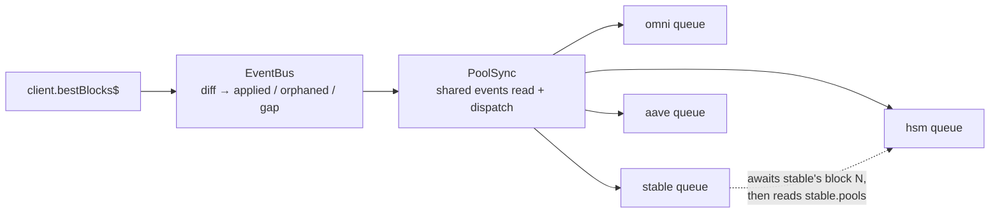

# SOR Engine — Pool Sync

> **Package:** `sdk-next` | **Scope:** `src/pool/` — `PoolSync`, `PoolClient`, `EventBus`,
> the AMM clients, and `QueryCache`.
> Related: [SOR_SPEC.md](SOR_SPEC.md), [ORACLE_SPEC.md](ORACLE_SPEC.md),
> [MM_ORACLES.md](MM_ORACLES.md).

## Abstract

Every pool client is driven from **one** chain feed by **one** driver. `PoolSync` owns the
subscription and the per-block event reads; each client keeps its own serial queue and
resolves independently. The only wait in the system is the real dependency edge, where a
derived pool (HSM ← Stableswap) waits for its source to finish *that block* and then simply
reads its store.

The feed follows **best**, not finalized, because finality can lag ~30s — too late to price
a market. Best forks, so reorgs are healed inline at the new tip by replaying the events a
client matched on the orphaned side; no polling, no finality wait, no periodic resync, and
without waiting for the next trade to touch a stale asset.

Correctness is established differentially: `probeAmm` diffs the live store against a fresh
block-pinned reload, field by field, every block.

---

## Guarantees

- **No tearing.** State that changes together on-chain (an omnipool asset's `reserve` +
  `hub_reserve`, a stableswap's reserves + pegs) is never observed half-updated.
- **No cross-subscription skew.** One feed, one coherent point per block.
- **Best-block tracking.** The store reflects best, not finalized.
- **Reorg recovery.** State read on an orphaned fork heals at the reorg block itself,
  within `REPLAY_DEPTH`.
- **Bounded convergence.** The few fields that accrue without an event stay within a
  measured, documented bound — see [Accuracy & drift](#accuracy--drift).

---

## Architecture



| Component | Role |
|---|---|
| `EventBus` | follows `bestBlocks$`, diffs it into `{ applied, orphaned, gap }`, reads a block's events pinned via `eventsAt(hash)` |
| `PoolSync` | singleton; owns the subscription, the watchdog, client registration and topological order; dispatches each pass |
| `PoolClient` | pool-specific logic, store, consumer API, own matched-event ring, own serial queue |
| `PoolQuery` | every chain read a client makes, as named scopes over `QueryCache` |
| `PoolStore` | serialized commits; `update()` returns the queued promise so a commit can be awaited |

---

## The chain feed

`bestBlocks$` carries the **whole unfinalized chain** (best → finalized) on every change, so
a single emission closes a gap or replaces a reorged suffix. `EventBus` diffs each emission
against the last:

- `applied` — blocks whose hash it has not delivered, ascending. The tip is the last entry;
  everything under it was gap-filled or reorg-replaced.
- `orphaned` — previously delivered blocks whose height now carries a **different hash**. A
  height that simply dropped out of the window was finalized, not replaced.
- `gap` — the feed advanced past its own window, so the blocks between are unreachable and
  no replay can reconstruct them; the driver reseeds.

Gaps and reorgs therefore fall out of the feed itself. There is no `parentHash` walking and
no `getBlockHeader` on the hot path.

The first update applies only the head — blocks under it are already reflected in the
snapshot a client seeds from.

---

## Per-block pass

The engine's serial section is **one events read for the tip**, then dispatch. It returns
without awaiting any client, so the next update is handled while clients are still
resolving.

```ts
concatMap(async ({ applied, orphaned, gap }) => {
  if (gap) this.reseedAll('gap');

  const block = applied[applied.length - 1];
  const below = applied.slice(0, -1);

  /** One events read per referenced block, shared by every client */
  const cache = new Map<string, Promise<DecodedEvent[]>>();
  const eventsOf = (ref: BlockRef) => { /* memoized eventsAt */ };

  this.dispatch({ block, events: await eventsOf(block), below, orphaned, eventsOf });
});
```

`dispatch` hands each client its pass. Clients are ordered sources-first, so a dependent
receives its sources' completion promises for **this** block:

```ts
for (const client of this.clients) {
  const deps = client.dependencies().map((dep) => done.get(dep)).filter(Boolean);
  done.set(client, client.syncBlock(ctx, deps));
}
```

### Client pass

`applyBlock` seeds on the first pass, then per block:

1. **Blocks under the tip** — read each one's events, keep what this client matched (for a
   later reorg), and stage it for replay.
2. **Orphaned side** — take what this client matched there, then drop those entries so a
   later reorg cannot replay stale residue.
3. **Replay once at the tip** — the union of both, not per block. Handlers re-read absolute
   state, so only the newest read matters.
4. **Resolve the tip** — effects, then handlers.
5. **Await sources** — only the tick can need a source's block.
6. **Tick** — per-block recompute for values that move between events.
7. **Commit** — one `store.update`, with the cursor advanced *inside* it so `block` /
   `blockHash` stay coherent with the emission. A reorg commits even with no mutations, so
   the cursor leaves the orphaned hash.

### Resolution stages

| Stage | Source | Produces |
|---|---|---|
| **Effects** | `syncEffects()` → `apply(e, block)` | side effects only — cache refresh, param stash, `requestResync`; run first so the caches the tick reads are fresh |
| **Handlers** | `syncHandlers()` → `resolve(e, block)` | `PoolMutation[]`, by re-reading absolute state pinned at `block.hash` |
| **Tick** | `tickMutations(block)` | per-block recompute for values that move between events — peg convergence, amp/weight ramp |

Events are **pointers to dirty state**, never payloads: a handler re-reads rather than
applying a delta, so a replayed or duplicated event is idempotent.

---

## Dependency edges

```ts
/** Clients whose committed state this one derives from */
protected dependencies(): PoolClient<any>[] {
  return [];
}
```

HSM returns `[this.stableClient]`; everything else returns `[]`. Registration pulls
dependencies in transitively, re-sorts, and throws on a cycle. There are no stages and no
barrier — the waiting is edge-local, so if stableswap is slow HSM lags with it (it cannot
price without it) while omni, xyk, aave and lbp are untouched.

The merge is a plain read with a reference check. `PoolStore.update` replaces only the pools
it touched and leaves the rest as the same object, so **reference identity is the "did my
source change" test** — no dirty set, no staged snapshot.

---

## Query cache

Every client read goes through a named `QueryCache` scope, declared on `PoolQuery` and its
per-pool subclasses (`OmniQuery`, `StableSwapQuery`, …). A scope has two tiers:

- **`live`** — written by an event (`set`) or refreshed at a block (`refresh`). Checked
  first and has no expiry, so an event that says a value moved is authoritative.
- **`cache`** — the fetch tier, memoized per its policy: `'block'` (released when the read
  moves to a new block), `'persistent'`, or a numeric TTL in ms.

Reads at an unpinned tag are never memoized. Every read is attributed to a tier —
`live` / `memo` / `fetch` / `unpinned` — and chain-hitting tiers are also counted per scope,
so the heaviest query is visible at runtime (`QueryCache.tally`, surfaced by the AMM
monitor app). Seeding calls `clear()` on the whole cache, so no event-written value
survives into a fresh snapshot.

Steady state is roughly **6 chain reads per block** across all clients.

---

## Accuracy & drift

Seed plus events keeps almost everything **exact**: a balance, a reserve, a tradability
flag, a fee is re-read pinned at the block whose event moved it, so a fresh reload of the
same block agrees bit for bit. Two things converge instead, because they move with **no
event to observe**, and they correspond to the two ways an asset can bear yield.

### The two yield mechanisms

- **Price-side.** `BIL` is a yield-bearing token whose NAV accrues in its *oracle price*.
  That price is the target of a stableswap peg, so the accrual lands in `pegs.*` of
  `2-Pool-BIL` — its **balances stay exact**.
- **Balance-side.** Aave aTokens (`aDOT`, `aUSDT`, `aUSDC`, `aETH`, `aSOL`, `aEURC`) accrue
  in `balanceOf` via the liquidity index, so a pool's *holding* grows every block with no
  Substrate event. That lands in `tokens.<id>.balance` — and in HSM's `collateralBalance`
  for erc20 collateral held at the facilitator.

Each asset appears in exactly one of the two, which is what makes the split legible.

### Measured

A ~1.9h run (1255 stableswap checks) against Catfish, `bad = 0`:

| client | field | asset / pool | max |
|---|---|---|---|
| stable | pegs | 2-Pool-BIL | **3 ppm** |
| stable | balance | aUSDT, aUSDC | 2 ppm |
| stable | balance | aEURC, aDOT | 1 ppm |
| stable | balance | aETH, aSOL | <1 ppm |
| hsm | balance | aUSDC, aUSDT | 2 ppm |
| omni | balance | aDOT | <1 ppm |
| aave | — | — | **0** (event traffic covers it) |

Aave is worth calling out: a money-market reserve is touched by any `Supply`, `Withdraw` or
trade against it, which is frequent enough that its balances are never stale at all.

### Is 2–3 ppm material?

2–3 ppm is **0.2–0.3 basis points**, and it is an *upper* bound on the price error rather
than the expected one: a swap prices off the **ratio** of reserves, both legs of these pools
accrue at similar rates so the errors largely cancel, and stableswap amplification
deliberately flattens price against reserve movement.

Every ratio below is stated against a **100 ppm (0.01%) reference fee** — deliberately under
the 200 ppm floor any real pool charges, so the comparison is always harsher than reality.

| reference | ppm | vs drift |
|---|---|---|
| measured drift | 2–3 | 1× |
| **reference fee (0.01%) — under every real pool** | **100** | **33–50×** |
| smallest displayable tick on a $1 stable | 100 | 33–50× |
| stableswap pool fee, measured on-chain | 200–1000 | 70–500× |
| 2-Pool-BIL's own fee — the pool carrying the peg drift | 1000 | 330–500× |
| default UI slippage tolerance (0.1–1%) | 1000–10000 | 330–5000× |

Pool fees are `Stableswap.Pools.fee` as read from the chain: 200 ppm across the 100–111
series, 400 for 112/113/143/146, 500 for 10044, 690 for 690/4200/90001, and 1000 for 10055.
The pool fee is only the floor of what a trade pays — price impact adds to it — so comparing
against a fee below even that floor is doubly conservative.

It sits **below the smallest price increment anyone quotes or displays**, and it is
unarbitrageable by construction: an arb must clear the fee plus transaction cost, so even at
the 100 ppm reference it needs **>100 ppm** of mispricing to be worth acting on — and >200 on
the cheapest pool that actually exists. 3 ppm cannot be traded against.

The comparison a consumer actually reasons about is slippage tolerance, since that is the
buffer that exists to absorb quote inaccuracy — which is what this drift is. 3 ppm is
**0.0003%**, so a user on the 1% default has 3300× the headroom, and one who tightens to 0.1%
still has 330×. That buffer is sized for real price movement between quote and execution,
which on any volatile pair dwarfs 3 ppm within a single block.

For the drift to even reach the tightest of those settings it would have to grow 330×, from
3 ppm to 1000 ppm — about 32,000 blocks of accrual, or **two days with no refresh of any
kind**, against an hourly reseed plus a re-read on every trade that touches the pool.

In money it is scale-invariant: both the drift and the fee are proportional to trade size, so
their ratio is fixed. At the 100 ppm reference the drift is **1/50th of the fee** at every
size; against the fees really charged it is 1/100th to 1/500th.

| swap | drift at 2 ppm | fee at the 0.01% reference |
|---|---|---|
| $1,000 | $0.002 | $0.10 |
| $10,000 | $0.02 | $1.00 |
| $100,000 | $0.20 | $10 |
| $1,000,000 | $2.00 | $100 |

Both are bounded by magnitude; only one is also bounded by direction.

A **peg** is a ratio input, so it gets neither attenuation above: 3 ppm in propagates to the
quote at ~1:1, and it lags on whichever side its target moved. BIL's NAV rises monotonically,
so a stale peg values it slightly low and a taker buying BIL gets it a hair cheap — the error
can favour the taker rather than the pool. Harmless because 3 ppm is 1/33rd of the fee, not
because of which way it points.

A **balance** is **one-sided in the safe direction**: aToken balances only grow, so the store
understates a reserve, quotes come out conservative, and a user receives at least what was
quoted. A max-withdraw computed off it is a hair short of the true max, so it succeeds
rather than reverting.

### What bounds it

Two mechanisms, neither of them dedicated to accrual:

- **Event traffic.** Any trade or liquidity op touching a pool re-reads its erc20 legs pinned
  at that block, so an actively traded pool is refreshed continuously. This is why aave never
  drifts at all and why the measured maxima are 2–3 ppm rather than an hour's worth.
- **`RESEED_INTERVAL` (60 min).** A full pinned reload, which caps an *untouched* pool at one
  hour of accrual: **5.7 ppm** at ~5% aToken APY, and 57 ppm even at an absurd 50%.

There is deliberately no periodic erc20 re-read. One existed on a block cadence, but with the
reseed at 60 min it could never be the binding constraint — whenever it fired, the store had
already been fully refreshed more recently — so it spent reads to tighten a bound that was
already irrelevant. Its worth was ~0.2 ppm for ~11% of the read budget at a tight cadence.

**The guarantee to hold:** drift stays under **1 bp** as long as `RESEED_INTERVAL ≤ 60 min`.
The bound scales linearly with that interval, so it is the constant to guard — at 10 hours an
untouched leg would reach ~57 ppm and start to matter.

---

## Resync & watchdog

`requestResync()` clears a client's seeded flag; the next pass seeds it pinned at that
block. Reseeding one client does not disturb the others.

One watchdog in the engine, three edge-triggered sources, merged:

- **recovery** — connection `offline → online`.
- **gap** — a `>= GAP_THRESHOLD` jump in **finalized** height (monotonic and reorg-immune,
  so best-block reorgs never trip it), or a feed window overrun.
- **periodic** — unconditional, every `RESEED_INTERVAL` (60 min).

None observes post-resync state, so a resync cannot feed back into its own trigger. A stream
error restarts the subscription (throttled) and reseeds everyone.

> `connection$` is a request-latency probe on the shared socket, ~50ms in the steady state.
> Node fork-churn episodes can push it past its timeout, so a bad patch may fire several
> genuine `offline → online` reseeds — correct for real outages, eager during churn.

---

## Consumer API

- **`getSubscriber(): Observable<T[]>`** — shared and ref-counted; each emission is the
  **delta** (only pools that changed), replayed to late subscribers. Registers the client
  with the engine for as long as anyone is subscribed.
- **`getPools(at?): Promise<T[]>`** — ad-hoc fully-pinned load. Never registers, so a
  standalone pinned client (a probe's reference loader, a consumer-created client) works
  without touching the engine.

`at` is a block hash; unset follows best.

---

## Validation

Both probes run against `ApiUrl.Catfish1`, live, and are the gate for any change here.

- **`probeAmm`** — subscribes to every client, and for each committed block reloads the
  *same* block on a fresh pinned client and diffs field by field. Fields that converge are
  tolerated within `DRIFT_PPM = 100` and counted separately by kind (`pegs` / `balance`),
  attributed to the owning asset or pool with the worst ppm seen. Everything else must be
  exact.
- **`probePegs`** — narrows to the peg computation: for every source it compares the live
  anchor, EMA entry, MM price, fee and pool config against a fresh read at the same block,
  so a divergence names the input rather than the output.

---

## Invariants

- One pass belongs to exactly one block; `System.Events` is read atomically per block.
- A committed snapshot is fully block-pinned and cannot tear.
- The cursor a consumer reads is coherent with the emission it accompanies.
- Skipped best blocks are applied from the feed's own window; nothing is silently dropped.
- A reorg heals at the reorg block, within `REPLAY_DEPTH`, without a trade, without
  finality, without a periodic resync.
- Events are pointers, so replaying one is idempotent.
- Resync is edge-triggered only.

---

## Key types & terms

| Name | Meaning |
|---|---|
| `BlockAt` | block hash to read at; unset follows best |
| `BlockRef` | `{ hash, number }` |
| `ChainUpdate` | `{ applied, orphaned, gap }` from the feed diff |
| `BlockContext` | one pass: `{ block, events, below, orphaned, eventsOf }` |
| `DecodedEvent` | `{ index, pallet, method, data }` |
| `PoolMutation<T>` | `{ address, apply: (pool) => pool }` — a targeted store patch |
| `PoolEventHandler<T>` | `{ match(e), resolve(e, block) → PoolMutation[] }` |
| `PoolEventEffect` | `{ match(e), apply(e, block) }` — side effect, no store write |
| seed | first-pass `loadPools(block)`; one coherent pinned snapshot |
| tick | per-block recompute for between-event movement (pegs, amp ramp) |
| replay | re-run of matched events at the tip, healing orphaned and gap-filled blocks |
| cursor | `block` / `blockHash`, assigned inside the commit |

---

## Open items

1. **Stableswap peg representation.** `probeAmm` intermittently reports 10055's peg pair
   differing by a clean ×1.25 on both components while the ratio agrees to 0.2 ppm — a
   representation divergence, not a value one. Episodes last several blocks and self-heal.
   Denominator is a function of the anchor alone, so an elapsed off-by-one is ruled out.
   Under investigation; `probePegs` shows every compared input matching.
3. **`HOLLAR` drift tolerance.** `probeAmm` keys its balance allowance off
   `type === 'Erc20'`, which also covers HOLLAR — an erc20 that does not accrue and should
   be held exact.
4. Dependent behaviour when a source client is mid-reseed: skip the merge for that block, or
   merge last known state.
