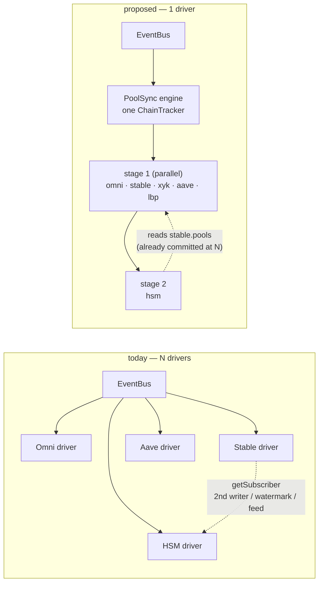
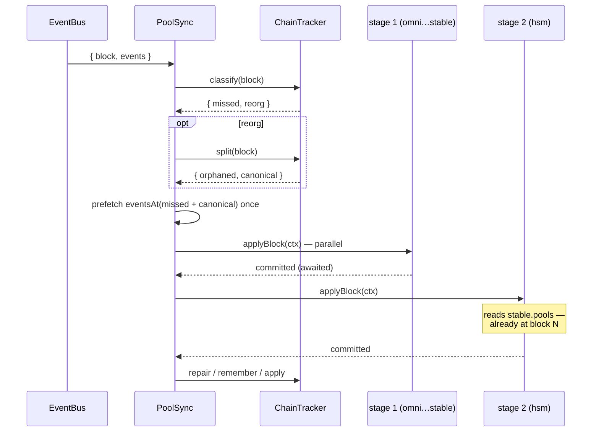

# Pool Sync Engine — design proposal

> Proposal for `packages/sdk-next/src/pool/`. Replaces the **per-client driver**
> described in [SOR_v2.md](./SOR_v2.md) with **one driver** that resolves all pool
> clients per block, in dependency order.
> Nothing here is implemented — this is the design to argue with first.

## Abstract

Every pool client consumes the **same** block stream. Today each one subscribes to it
separately, so no client knows where another is: chain work is repeated per client, and a
derived pool (HSM ← Stableswap) needs coordination machinery to borrow its source's state
for the same block.

Make the driver **one thing**. It owns the subscription and the chain lineage, and per
block it resolves clients in **dependency stages**, awaiting each stage's commits before
the next. A derived pool then simply *reads* its source's store: the ordering is the
guarantee, so there is nothing to negotiate — no watermark, no staged snapshot, no
forwarded feed, no second store writer.

---

## Why

Three costs fall out of per-client subscriptions:

- **Repeated chain work.** `ChainTracker.classify` walks `parentHash` once *per client per
  block*, and a reorg re-reads the same canonical blocks' events once per client. With 5
  clients a depth-4 reorg costs ~20 header fetches and ~20 `System.Events` reads where 4
  and 4 would do. Measured on catfish: ~57ms per header fetch, and 6 concurrent
  `eventsAt` reads pushed the health probe from 60ms to 833ms.
- **Cross-client coupling needs machinery.** HSM's stableswap-derived fields must belong to
  the same block as its cursor. Three attempts, all consequences of independence: a second
  store writer (two emissions per block, and a stale window that the differential probe
  caught at `#13488049`), a committed-cursor watermark plus `await` (folds *whatever the
  source holds now*, which can be a block ahead), and a forwarded per-block feed (works,
  but threads source pools through `tickMutations` — a hook that means "recompute drift",
  not "merge a dependency").
- **Duplicated lifecycle.** Five `switchMap` resync cycles and five watchdogs for one
  chain, one connection, and one finality stream.

The insight that removes all of it: with a single stream, block N's events already say
which pools are affected, so a dependency is an **order of processing** rather than a
message between peers.

---

## Today vs proposed



---

## Components

| Component | Role | Change |
|---|---|---|
| `EventBus` | one `System.Events` watch, per-block emission, redelivery dedupe, `eventsAt(hash)` | unchanged |
| `ChainTracker` | chain lineage: classify / split / repair / cursor + ring | **one instance in the engine**; ring holds `{number, hash}` only |
| **`PoolSync`** | **new.** owns subscription + tracker + watchdog; drives clients in stages | new file `pool/PoolSync.ts` |
| `PoolClient` | pool-specific logic, store, consumer API, own matched-event ring | sheds the driver, resync cycle, watchdog |
| `PoolStore` | `update()` returns the queued promise so a commit can be awaited | 2-line change |

---

## Per-block pass



Engine body:

```ts
concatMap(async ({ block, events }) => {
  const { missed, reorg } = await this.chain.classify(block);
  const window = reorg ? await this.chain.split(block) : EMPTY_WINDOW;

  /**
   * One events read per referenced block, shared by every client.
   */
  const cache = new Map<string, Promise<DecodedEvent[]>>();
  const eventsOf = (ref: BlockRef) => {
    let p = cache.get(ref.hash);
    if (!p) cache.set(ref.hash, (p = this.bus.eventsAt(ref.hash)));
    return p;
  };

  const ctx = { block, events, missed, reorg, ...window, eventsOf };

  /**
   * Stages run in order; a stage's commits are awaited, so a derived pool
   * reads its source's store already at this block.
   */
  for (const stage of this.stages) {
    await Promise.all(stage.map((c) => this.drive(c, ctx)));
  }

  for (const m of missed) this.chain.remember(m);
  if (reorg) this.chain.repair(window.orphaned, window.canonical);
  this.chain.apply(block);
});
```

Client side — same work as today's `subscribeEvents` body, minus the lineage:

```ts
  /**
   * Resolve and commit one block.
   *
   * - Seeds on first call (pinned `loadPools`), then resolves per block
   * - Returns once the commit landed, so dependents can read the store
   */
  async applyBlock(ctx: BlockContext): Promise<void> {
    if (!this.seeded) return this.seed(ctx.block);

    const muts: PoolMutation<T>[] = [];

    for (const m of ctx.missed) {
      muts.push(...(await this.resolve(m, await ctx.eventsOf(m))));
    }
    if (ctx.reorg) muts.push(...(await this.heal(ctx)));
    muts.push(...(await this.resolve(ctx.block, ctx.events)));

    if (muts.length > 0 || ctx.reorg) {
      await this.store.update((state) => {
        this.block = ctx.block.number;
        this.blockHash = ctx.block.hash;
        return this.applyMutations(state, muts);
      });
    }
    this.remember(ctx.block, touched);
  }
```

`await this.store.update(...)` is the whole ordering mechanism. `PoolStore.update` already
serializes on a promise queue; returning it removes every microtask-ordering argument the
watermark and feed designs needed.

---

## Reorg pass

Lineage is global, but **matched events are per client** — each client matched different
events on the orphaned fork. So the split is shared and the replay is local:

- `ChainTracker.split(block)` returns `{ orphaned: BlockRef[], canonical: BlockRef[] }` —
  hashes only, no `touched`.
- Each client keeps its own bounded `Map<hash, DecodedEvent[]>` of what *it* matched per
  applied block (same data as today's ring, same `REORG_DEPTH` bound).
- `client.heal(ctx)` = own touched for `orphaned` hashes, plus its matches from
  `ctx.eventsOf(canonical)`, rereaad at the new tip; then drop those hashes.

The canonical blocks' events are fetched **once** for all clients. The `depth === canon`
invariant and the pairing rules stay exactly as documented in
[SOR_v2.md](./SOR_v2.md#heal--bounded-history--reread).

---

## Dependency stages

```ts
  /** Clients whose committed state this one derives from */
  protected dependencies(): PoolClient<any>[] {
    return [];
  }
```

HSM returns `[this.stableClient]`; everything else returns `[]`. The engine topologically
sorts registered clients into stages — currently `[[omni, stable, xyk, aave, lbp], [hsm]]`.
A cycle in the graph is a programming error and should throw at registration.

HSM's merge becomes a plain read with a reference check, entirely inside HSM:

```ts
  protected async tickMutations(): Promise<PoolMutation<HsmPoolBase>[]> {
    const muts: PoolMutation<HsmPoolBase>[] = [];
    for (const pool of this.store.pools) {
      const stablePool = this.stableClient.pools.find((s) => s.id === pool.id);
      if (!stablePool || this.merged.get(pool.id) === stablePool) continue;
      this.merged.set(pool.id, stablePool);
      muts.push({ address: pool.address, apply: (p) => ({ ...p /* fields */ }) });
    }
    return muts;
  }
```

`PoolStore.update` replaces only the pools it touched and leaves the rest as the same
object, so **reference identity is the "did my source change" test** — no dirty set, no
staged snapshot, and unchanged upstream still means no muts, no commit, no emission. It
needs a public `get pools()` on `PoolClient` (protected members aren't reachable across
sibling subclasses), which also lets the `pools()` probe subclasses in `verifyEds.ts` go.

---

## Lifecycle & registration

The engine is lazy and shared, like `EventBus`:

```ts
  getSubscriber(): Observable<T[]> {
    return defer(() => {
      const sub = PoolSync.shared(this.client).register(this);
      return this.store.asObservable().pipe(
        skip(1),                       // drop replay; first emission is the fresh seed
        finalize(() => sub.unsubscribe())
      );
    }).pipe(/* changeset delta + share, as today */);
  }
```

- `register(client)` pulls in `dependencies()` transitively, re-sorts stages, and starts
  the subscription if idle. A dependency is driven even when nobody subscribes to it.
- Last unregister stops the subscription and clears the tracker.
- **Standalone pinned clients are unaffected** — `getPools(at)` never registers, so the
  `verifyEds` reference loaders and consumer-created clients keep working as-is.

---

## Resync & watchdog

Per-client `resync$` + `switchMap` cycles collapse into per-client **seed flags** on the
engine:

- `client.requestResync()` → `engine.reseed(client)` → clears that client's `seeded` flag;
  the next block seeds it pinned at that block. No cycle teardown, no `mem` bump.
- One watchdog in the engine: finalized-gap (`>= 3`), periodic (60 min), connection
  recovery → reseed **all** clients.
- `watchGuard` becomes engine-level: a stream error restarts the subscription and reseeds
  everyone.

Reseeding one client no longer disturbs the others, which today's shared-ref-count teardown
can do.

---

## Cost

Per block, `N` registered clients, reorg depth `d`, gap `g`:

| work | today | proposed |
|---|---|---|
| `getBlockHeader` (classify) | `N` | 1 |
| `getBlockHeader` (fork walk) | `N × d` | `d` |
| `eventsAt` (canonical) | `N × d` | `d` |
| `eventsAt` (gap backfill) | `N × g` | `g` |
| store writers per pool | 1, or **2** for HSM | 1 |
| emissions per block per pool | 1, or **2** for HSM | ≤ 1 |

A depth-4 reorg with 5 clients goes from ~40 chain calls to ~8 — on the exact hot path
where fork churn already slows the node (see the unincluded-segment note in
[SOR_v2.md](./SOR_v2.md#why-reorgs-are-frequent-right-now)).

---

## Risks & mitigations

- **One slow client delays the pass.** Today a slow AAVE resolve can't delay OMNI's commit;
  with stages, the pass ends when the slowest client in each stage finishes, and the next
  block waits. Mitigation: wrap `applyBlock` in a per-client timeout — on expiry, log,
  `reseed(client)`, and continue the pass without it. **Open:** should dependents of a
  timed-out client skip their merge for that block (stay a block behind) or proceed?
- **Head-of-line blocking on the stream.** The engine's `concatMap` queues, exactly as each
  client's does today, so a sustained slowdown lags rather than skips; gap backfill covers
  whatever the bus coalesces. Unchanged in kind, but now shared — worth logging pass
  duration.
- **Failure isolation.** A throwing client must not abort the pass for the others:
  `Promise.allSettled` per stage, with a rejection triggering that client's reseed.
- **Bigger blast radius.** One engine touching all pool types means a regression hits
  everything; hence the phased migration below, with the differential probe as the gate.

---

## Migration

Each phase is independently testable, and the probe (`verifyEds.ts`) is the gate.

| phase | change | check |
|---|---|---|
| 1 | `PoolStore.update` returns its queued promise | unit tests |
| 2 | add `PoolSync`; move driver + lineage + watchdog out of `PoolClient`; revert the `processed$` / `blockSource` / `DrivenBlock` feed; one shared `eventsOf` | 20-min probe with omni + stable + xyk + aave through reorg churn |
| 3 | stages + `dependencies()`; HSM tick reads `stableClient.pools`; public `get pools()`; drop `pools()` probe overrides | probe with **HSM enabled** — one check line per block, no duplicate, `#13488049`-class staleness gone |
| 4 | fold this document into `SOR_v2.md` as the current design | — |

The interim feed design (`processed$` + `blockSource`, currently in the working tree and
green on tests) is a **temporary** step: correct, but it pays for the coupling with a
payload parameter on `tickMutations`. Phase 2 deletes it.

---

## Open questions

1. Dependent behaviour when a source client times out or is mid-reseed — skip the merge
   this block, or merge the last known state?
2. Should the engine expose pass telemetry (duration, per-client resolve time) as a debug
   log, given fork churn is the dominant latency source right now?
3. `REORG_DEPTH` currently bounds both tracker lineage and each client's matched-event
   ring — keep one constant, or let a client keep a shallower ring?
4. Do we want `applyBlock` to be `protected` (engine as a friend via a narrow internal
   interface) or public on `PoolClient`? A narrow `PoolSyncTarget` interface keeps the
   public surface honest.
